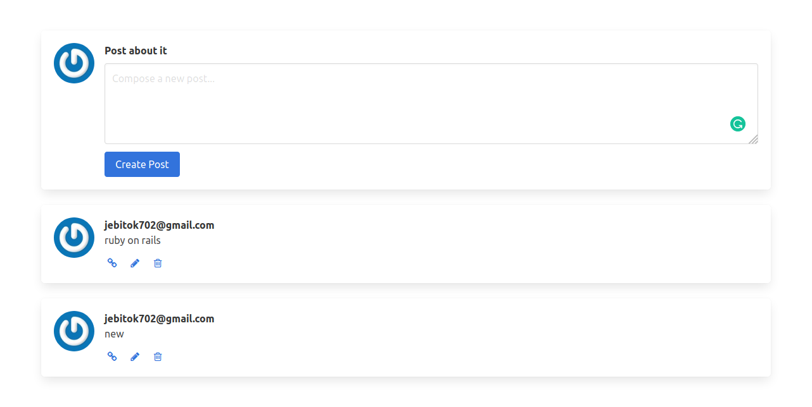
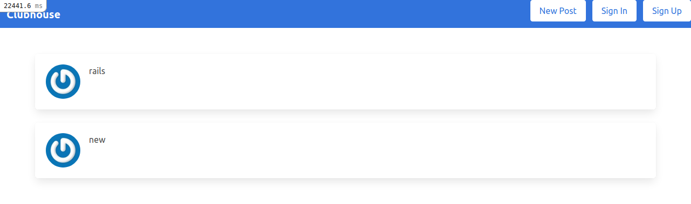

# Exclusive-Clubhouse(Members-Only)



This project puts your knowledge of authentication, sessions and cookies as well as forms, models, controllers, and validations to the tests. The aim of the project is to build a Exclusive Clubhouse that allows users to see the identity of authors of posts but outsiders just view stories but authors remain anonymous, using devise and Rails methods/helpers.

## Built With

- Ruby -v 2.7.0
- Rails -v 6.1.1
- Live-Reloader
- Bulma(CSS)
- SQLite3
- Devise
- Guard

## Getting Started

### Prerequisites

To get this project up and running locally, you must already have ruby and rails plus the necessary gems installed on your computer

**simple steps set up on your local machine**

```
- $ git clone `$ git clone https://github.com/jebitok-dev/Members_only`
- $ git checkout develop
- Run `cd Twitter-clone`
- $ bundle install
- $ rails db:create
- $ rails db:migrate
```

### Run tests

- `$ rails s `
- http://localhost:3000/users/sign_up: user can sign_up by entering their email, password, confirm password and submit the sign_up form or login using email and password.
- User can create post(s)
- User not signed in can see posts without seeing the email(username) of the author.
- 

## Author

👤 **Sharon Jebitok**

- Github: [jebitok-dev](https://github.com/jebitok-dev)
- Twitter: [@jsebitok](https://twitter.com/jsebitok)
- LinkedIn: [Sharon Jebitok](https://www.linkedin.com/in/sharon-jebitok/)

## 🤝 Contributing

Contributions, issues and feature requests are always welcome!

I love meeting other developers, especially ones that give me advice on how to improve my work.

Feel free to check the [issues page](https://github.com/jebitok-dev/Members_only/issues).

### How to Contribute

To get a local copy up and running follow these simple example steps.

````
- Fork the repository
- git clone https://github.com/your_username/Members_only
- git checkout develop
- git checkout -b branch name
- run ```$ bundle install```
- $ rails db:create
- $ rails db:migrate
- git remote add upstream https://github.com/jebitok-dev/Members_only
- git pull upstream develop
- git commit -m "commit message"
- git push -u origin HEAD
````

## Show your support

Finally, if you've read this far, don't forget to give this repo a ⭐️. They're free . . . I think.

## Acknowledgments

- Odin Project on [Twitter-Clone project](https://www.theodinproject.com/courses/ruby-on-rails/lessons/authentication)

- [Microverse](https://microverse.org).

<!-- ## 📝 License -->
